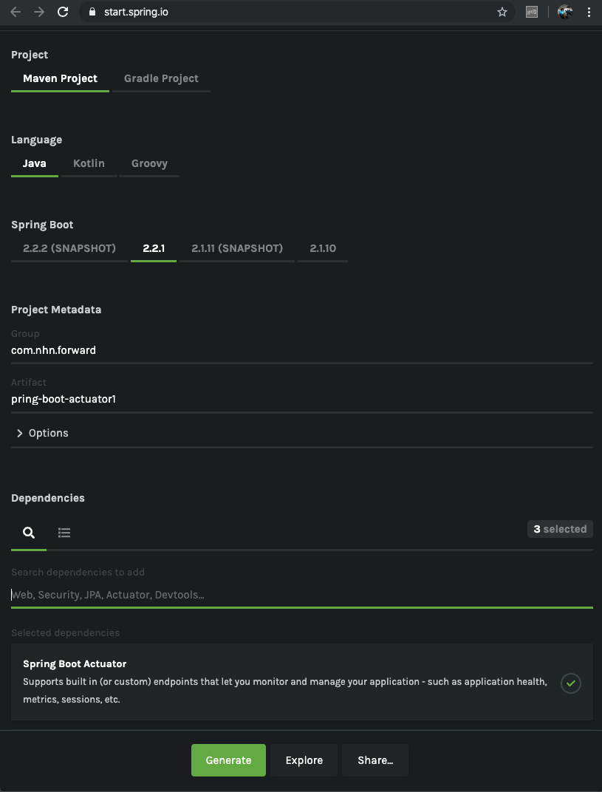
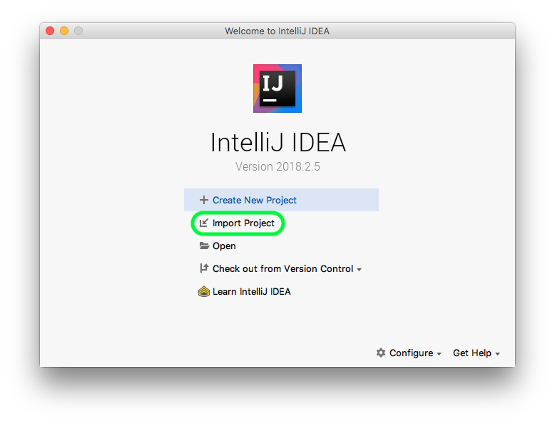
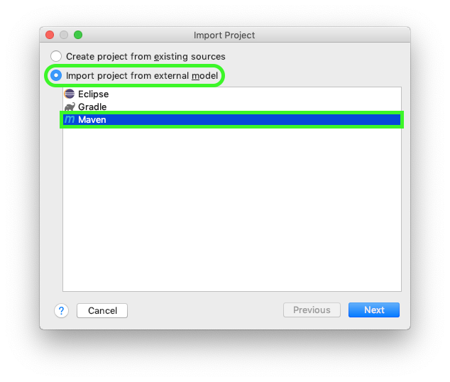
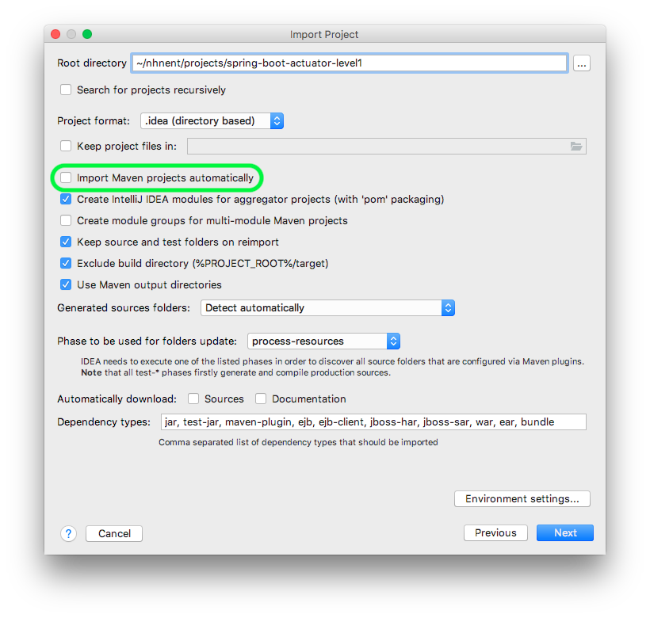
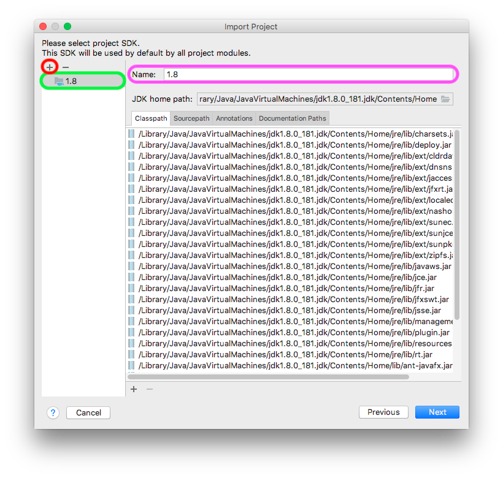
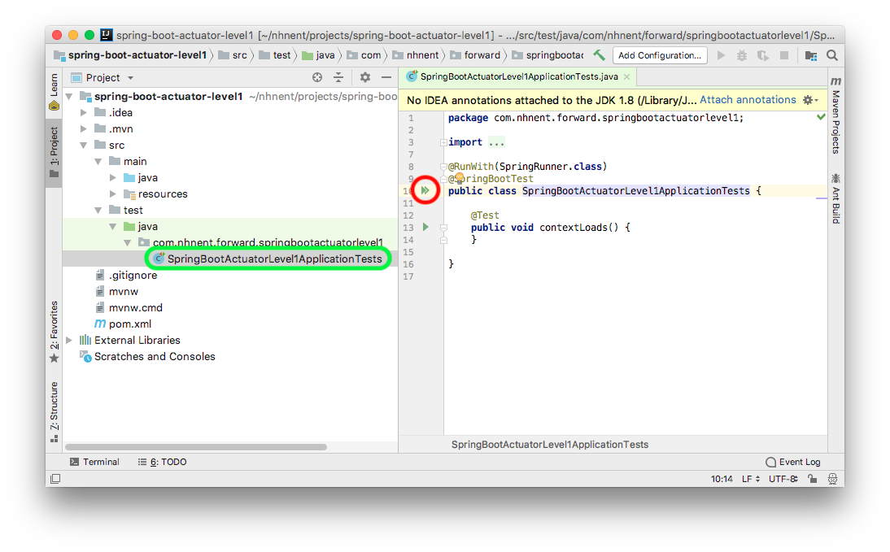
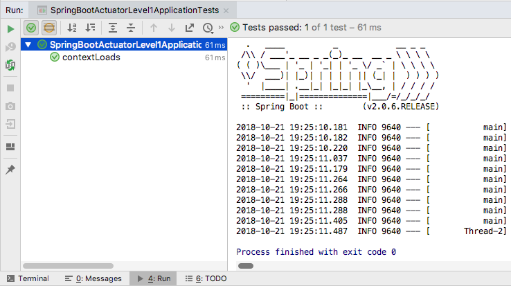

==============================
스프링 부트 애플리케이션 생성
==============================

Spring Initializr로 프로젝트 생성
======================================

https://start.spring.io/ 에 접속하겠습니다.

Generate a ``Maven Project`` with ``java`` and Spring Boot ``2.0.6``

* Group : ``com.nhnent.forward``
* Artifact : ``spring-boot-actuator``
* **Dependencies** : ``Web``, ``Actuator``, ``DevTools``

**Generate Project** 로 프로젝트 생성합니다.

* 의존성에 꼭 ``Web``, ``DevTools`` 을 추가하도록 합니다.(스크린 샷에는 가려져서 안 보입니다.)
* ``spring-boot-actuator.zip`` 파일을 다운로드 해서 적절한 위치에 압축해제 합니다.

IntelliJ에 프로젝트 추가
=============================

* ``Import Project`` 를 선택해서 방금 전 압축을 푼 프로젝트의 폴더를 선택.

* ``Import project from external model`` 를 체크하고 ``Maven`` 을 선택하고 ``Next`` 를 클릭.

* ``Import Maven projects automatically`` 를 체크하고 ``Next`` 를 클릭.

* 계속 ``Next`` 를 누르다보면 JDK를 설정하면 화면에서 꼭 **1.8** 을 선택해야 합니다.
* 만약 **1.8** 이 없으면 좌측 상단 ``+`` 버튼을 클릭해서 직접 설정해야 합니다.

그 후 계속 ``Next`` 를 누르면 해당 프로젝트로 IntelliJ 가 기동됩니다.

pom.xml 확인
===============================

.. code-block:: xml

        <dependency>
            <groupId>org.springframework.boot</groupId>
            <artifactId>spring-boot-starter-actuator</artifactId>
        </dependency>
        <dependency>
            <groupId>org.springframework.boot</groupId>
            <artifactId>spring-boot-starter-web</artifactId>
        </dependency>

        <dependency>
            <groupId>org.springframework.boot</groupId>
            <artifactId>spring-boot-devtools</artifactId>
            <scope>runtime</scope>
        </dependency>

* 위와 같은 구성으로 확인되면 OK

spring-boot 애플리케이션 테스트
===============================

* `SpringBootActuatorAplicationTests` 를 테스트해 봅니다.

* 테스트 성공 !!! > **애플리케이션이 정상적으로 설정됨** 을 확인할 수 있습니다.

