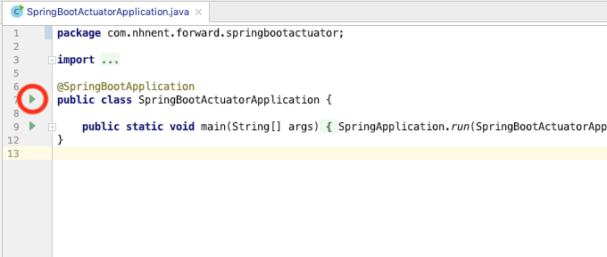
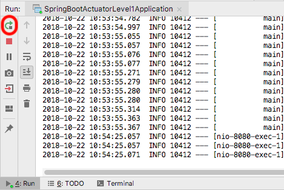

==================================
엔드포인트 구성
==================================

애플리케이션 구동과 재시작
=============================

시작하기 전에 먼저 스프링 부트 애플리케이션을 구동하는 방법을 알아보겠습니다.

* 빨간 원에 있는 녹색 삼각형 버튼을 누른 후 ``Run ...`` 으로 시작하는 메뉴를 선택하시면 애플리케이션이 기동됩니다.

스프링 부트 애플리케이션을 재시작하는 방법을 알아보겠습니다.

* IntelliJ 레이아웃 하단에 Run 창에서 빨간 원에 있는 버튼을 누르면 애플리케이션이 재시작됩니다.

기본 웹 엔드포인트 확인
=============================

애플리케이션을 시작하지 않았다면 먼저 기동해주세요

http://localhost:8080/actuator 에 접속해서 웹 환경에서 기본으로 제공되는 엔드포인트를 확인해 봅니다.

.. code-block:: json

    {
        "_links": {
            "self": {
                "href": "http://localhost:8080/actuator",
                "templated": false
            },
            "health-path": {
                "href": "http://localhost:8080/actuator/health/{*path}",
                "templated": true
            },
            "health": {
                "href": "http://localhost:8080/actuator/health",
                "templated": false
            },
            "info": {
                "href": "http://localhost:8080/actuator/info",
                "templated": false
            }
        }
    }

* 기본적으로 Web 환경에는 ``health``, ``info`` 2가지의 엔드포인트를 제공합니다.

주요 웹 엔드포인트 구성
=============================

.. code-block:: properties

    management.server.port=
    management.server.servlet.context-path=

    management.endpoints.jmx.exposure.include=health,info
    management.endpoints.web.exposure.exclude=
    management.endpoints.web.base-path=/actuator
    management.endpoints.web.path-mapping=

* 엔드포인트 서버 포트. 설정하지 않으면 기본 웹 애플리케이션 포트와 동일(default:8080)
* 엔드포인트 `context-path` 는 기본적으로 빈 값
* 기본 포함되는 엔드포인트 : ``health``, ``info``
* 제외 엔드포인드는 기본적으로 없음
* 엔드포인트 기본 경로 : ``/actuator``

  * ``management.server.servlet.context-path`` 경로 하위에 상대경로로 설정
* 엔드포인트 경로 재매핑은 기본적으로 없음

모든 웹 엔드포인트 노출 구성
----------------------------------

액추에이터의 모든 웹 엔드포인트에 접근할 수 있게 **직접** 설정해 보겠습니다. 아래에 스프링 부트 레퍼런스 문서 일부를 힌트로 제공하니 참고하시길 바랍니다.

Hint: Spring Boot Reference 일부
----------------------------------------

To change which endpoints are exposed, use the following technology-specific ``include`` and ``exclude`` properties:

================================================  =========================
Property                                          Default
================================================  =========================
``management.endpoints.jmx.exposure.exclude``
``management.endpoints.jmx.exposure.include``     ``*``
``management.endpoints.web.exposure.exclude``
``management.endpoints.web.exposure.include``     ``info``, ``health``
================================================  =========================

The include property lists the IDs of the endpoints that are exposed. The ``exclude`` property lists the IDs of the endpoints that should not be exposed. The exclude property takes precedence over the ``include`` property. Both include and exclude properties can be configured with a list of endpoint IDs.

For example, to stop exposing all endpoints over JMX and only expose the ``health`` and ``info`` endpoints, use the following property:

.. code-block:: properties

    management.endpoints.jmx.exposure.include=health,info

``*`` can be used to select all endpoints. For example, to expose everything over HTTP except the ``env`` and ``beans`` endpoints, use the following properties:

.. code-block:: properties

    management.endpoints.web.exposure.include=*
    management.endpoints.web.exposure.exclude=env,beans

:Note: 아래 답이 나오기 전에 직접 해봅시다.

모든 웹 엔드포인트를 오픈 노출 답
-----------------------------------

``src/main/resources/application.properties`` 파일을 아래 속성을 추가합니다.

.. code-block:: properties

    management.endpoints.web.exposure.include=*

모든 Web 엔드포인트를 오픈하는 구성 확인
-------------------------------------------

* 애플리케이션을 재시작한 후
* http://localhost:8080/actuator 를 확인하면 아래와 같은 결과를 확인할 수 있습니다.

.. code-block:: json

    {
        "_links": {
            "self": {
                "href": "http://localhost:8080/actuator",
                "templated": false
            },
            "auditevents": {
                "href": "http://localhost:8080/actuator/auditevents",
                "templated": false
            },
            "beans": {
                "href": "http://localhost:8080/actuator/beans",
                "templated": false
            },
            "health": {
                "href": "http://localhost:8080/actuator/health",
                "templated": false
            },
            "#주석" : "이하 중략"
        }
    }

웹 엔드포인트 활성화 구성
=============================

엔드포인트를 노출시킨다고 해서 모두 노출되는 것은 아닙니다. 노출 구성 이전에 해당 엔드포인트가 **활성화** 되어 있어야 합니다.

하지만 기본적으로 대부분의 엔드포인트들이 활성화 되어 있기 때문에 노출 설정 만으로도 확인할 수 있습니다.

**주요 엔드포인트들 활성화 기본값**

.. code-block:: properties

    # 모든 엔드포인트들을 전체 활성화시키거나 비활성화. 비어 있으면 각 엔드포인트 활성화 설정에 위임
    management.endpoints.enabled-by-default=
    management.endpoint.beans.enabled=true
    management.endpoint.conditions.enabled=true
    management.endpoint.configprops.enabled=true
    management.endpoint.env.enabled=true
    management.endpoint.health.enabled=true
    management.endpoint.logfile.enabled=true
    management.endpoint.loggers.enabled=true
    management.endpoint.mappings.enabled=true
    management.endpoint.prometheus.enabled=true
    # shutdown 엔드포인트는 기본이 비활성화
    management.endpoint.shutdown.enabled=false

:Warning: ``shutdown`` 엔드포인트는 애플리케이션을 종료시킬 수 있기 때문에 기본이 비활성화. 만약 사용할 경우 보안적으로 권한이 요구되는 설정이 필수로 해야합니다.