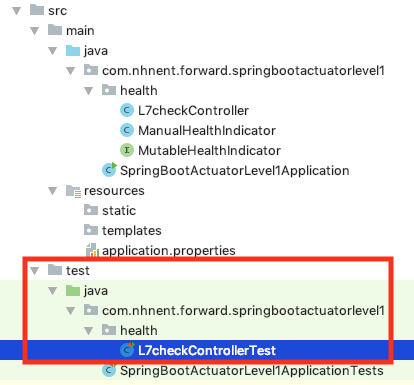
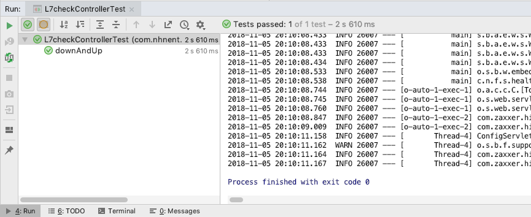

==========================
``health``
==========================

애플리케이션의 상태 정보를 표시하는 엔드포인트 입니다.

기본 구성 상테애서 http://localhost:8080/actuator/health 접근하게 되면 아래와 같이 응답합니다.

.. code-block:: json

    {
        "status": "UP"
    }

상세 조회 옵션
====================

원래 ``health`` 엔드포인트는 여러가지 상태 정보를 조합해서 애플리케이션 상태를 나타냅니다. 예를 들면

* 장비 디스크 용량
* DB, Redis, Elasticsearch, Rabbitmq 등 의존하는 인프라의 상태
* 사용자 정의 Health Indicator 상태

하지만 현재는 그냥 ``UP`` 만 나올 뿐이네요. 이는 ``health`` 엔드포인트 기본 구성 때문입니다.

.. code-block:: properties

    # health 상세 조회 옵션 : *never|when-authorized|always
    management.endpoint.health.show-details=never

아래와 같이 ``never`` 옵션이기 때문에 노출이 되지 않습니다. 위 속성 값을 ``always`` 로 변경합니다.

``src/main/resources/application.properties``

.. code-block:: properties

    management.endpoint.health.show-details=always

다시 애플리케이션을 기동하고 http://localhost:8080/actuator/health 에 접근해 봅시다.

.. code-block:: json

    {
        "status": "UP",
        "details": {
            "diskSpace": {
                "status": "UP",
                "details": {
                    "total": 250685575168,
                    "free": 185082695680,
                    "threshold": 10485760
                }
            }
        }
    }

:Note: ``when-authorized`` 옵션은 조회 권한이 있는 경우에만 상세롤 노출하는 옵션입니다. ``management.endpoint.health.roles`` 속성으로 추가된 권한들에 한해서 상세 보기가 가능합니다.

인프라 의존성
==================

이 상태에서 DB 의존성을 추가해 보겠습니다

``pom.xml`` 의 ``<dependencies>`` 요소에 아래 내용을 추가해주세요

.. code-block:: xml

        <dependency>
            <groupId>org.springframework.boot</groupId>
            <artifactId>spring-boot-starter-jdbc</artifactId>
        </dependency>
        <dependency>
            <groupId>com.h2database</groupId>
            <artifactId>h2</artifactId>
            <scope>runtime</scope>
        </dependency>

애플리케이션을 재기동 한 후 http://localhost:8080/actuator/health 에 접근해 봅시다.

.. code-block:: json

    {
        "status": "UP",
        "details": {
            "db": {
                "status": "UP",
                "details": {
                    "database": "H2",
                    "hello": 1
                }
            },
            "diskSpace": {
                "status": "UP",
                "details": {
                    "total": 250685575168,
                    "free": 185057075200,
                    "threshold": 10485760
                }
            }
        }
    }

위와 같이 DB 의존성을 추가하면 DB의 상태가 현재 애플리케이션 상태에 영향을 주게 됩니다.

인프라 의존성과 ``health``
===========================

``details`` 하위에 있는 모든 항목의 상태가 **UP** 여야지 애플리케이션 상태가 **UP** 가 됩니다.

* 만약 단 하나의 항목이라도 **DOWN** 상태라면 애플리케이션의 상태도 **DOWN** 이 됩니다.
* **UP** 상태일 시 응답 HTTP 상태코드는 `200` 입니다.
* **DOWN** 상태일 시 응답 HTTP 상태코드는 `503` (서비스를 사용할 수 없음) 입니다.

모든 인프라의 상태에 의존한다면?
---------------------------------

현재 개발 중인 애플리케이션이 `MySql`, `Redis`, `Elasticsearch`, `Rabbitmq` 에 의존한다고 가정해 보겠습니다.

그 상황에서 ``health`` 엔드포인트를 확인하면 아래와 같은 출력될 것 입니다.

.. code-block:: json

    {
        "status" : "UP",
        "details" : {
            "diskSpace" : {
                "status" : "UP"
            },
            "db" : {
                "status" : "UP"
            },
            "redis" : {
                "status" : "UP"
            },
            "elasticsearch" : {
                "status" : "UP"
            },
            "rabbitmq" : {
                "status" : "UP"
            }
        }
    }

* 위 출력은 실제 응답에 비해 간소화 됐습니다.

해당 애플리케이션은 `Redis` 를 캐시 용도로 사용하는데, 만약 `Redis` 인프라가 shutdown 되거나 연결된 네트워크에 이상이 생기면, 즉 `Redis` 상태가 **DOWN** 된다면 애플리케이션 또한 **DOWN** 상태가 될 것 입니다.

.. code-block:: json

    {
        "status" : "DOWN",
        "details" : {
            "diskSpace" : {
                "status" : "UP"
            },
            "db" : {
                "status" : "UP"
            },
            "redis" : {
                "status" : "DOWN"
            },
            "elasticsearch" : {
                "status" : "UP"
            },
            "rabbitmq" : {
                "status" : "UP"
            }
        }
    }

* `Redis` 가 다운된 경우 ``health`` 엔드포인트 응답

장애가 전파되면서 (`Redis` -> `Application`) 해당 애플리케이션은 사용할 수 없게 될 것 입니다. 하지만 `Redis` 가 **DOWN** 됐다고 해서 애플리케이션이 DOWN 되지 않고 **가용성을 확보해야** 할 것 입니다.

그렇다면 ``health`` 설정을 어떻게 해야할까요?

``src/main/resources/application.properties``

.. code-block:: properties

    management.health.redis.enabled=false

* 바로 위와 같이 ``health`` 엔드포인트에 `Redis` 상태가 포함되지 않게 비활성화 시키면 됩니다.

일반적으로 `DiskSpace` 나 `DB` 가 DOWN 되면 애플리케이션은 정상적인 서비스가 불가능 할 것 입니다.
하지만 `Redis`, `Elasticsearch`, `Rabbitmq` 와 같은 인프라가 DOWN 될지라도 서비스는 가용성을 확보해야할 것 같습니다.

그렇다면 아래와 같이 설정을 하는 것을 추천합니다.

.. code-block:: properties

    management.health.redis.enabled=false
    management.health.elasticsearch.enabled=false
    management.health.rabbit.enabled=false

위 구성에 따른 ``health`` 엔드포인트 응답

.. code-block:: json

    {
        "status" : "UP",
        "details" : {
            "diskSpace" : {
                "status" : "UP"
            },
            "db" : {
                "status" : "UP"
            }
        }
    }

:Warning: 위 상황은 일반적인 경우를 특정했습니다. 여러분이 개발하는 애플리케이션 성격에 따라서 ``health`` 가 인프라의 상태에 의존하는 구성을 적절히 조절하시길 바랍니다.

로드밸런서와 ``health``
===========================

스프링 부트 애플리케이션으로 운영하는 경우 상태 체크는 일반적으로 ``health`` 엔드포인트를 사용하게 됩니다.

기동된 애플리케이션의 인스턴스 상태를 확인하는 책임은

* 전통적으로는 로드밸런서(ex:L4), 클라우드 환경에서는 서비스 레지스트리(ex:NetflixEureka, Consul 등)가 담당합니다.

로드밸런서는 서비스의 고가용성과 확장성 그리고 **무중단 배포** 를 위해 사용합니다. 여기에서는 이 **무중단 배포** 에 대한 이야기를 해봅시다.

애플리케이션과 로드밸런서 가정
---------------------------------

* 로드밸런서는 L7을 사용한다.
* 로드밸런서에서 하위 인스턴스의 헬스 체크는 10초에 한 번씩 한다.
* 현재 운영되는 인스턴스는 2대

이 상황에서 배포를 한다고 가정해 봅시다.

1. A 인스턴스 종료

  * 이제 요청은 B 인스턴스로만 간다

2. A 인스턴스 배포 및 시작
3. B 인스턴스 종료
4. B 인스턴스 배포 및 시작

**하지만**

* 1-2 사이에서 로드밸런서는 A 인스턴스가 종료되었지만 최대 10초 간 A 인스턴스에 요청이 날라갈 것이며, 정상적이지 않은 상황이기 때문에 50%의 확률로 `502`(잘못된 게이트웨이) 또는 `503`(잘못된 게이트웨이) 오류가 발생할 것입니다.
* 2-3 사이의 경우에는 A 인스턴스가 기동이 됐지만 최대 10초 간 A 인스턴스에는 요청이 인입되지 않을 것이며, 그 사이 B 인스턴스는 종료된 상태이기 때문에 100%의 확률로 오류가 발생할 것입니다.

자 그렇다면 **정상적인 무중단 배포 시나리오** 를 확인해 봅시다.

무중단 배포 시나리오
-----------------------------

1. A 인스턴스의 상태를 `DOWN` 으로 변경
2. 10 초 간 대기 : 로드밸런서 제외 대기
3. A 인스턴스 종료
4. A 인스턴스 배포 및 시작
5. A 인스턴스 기동 확인 : ``health`` = `UP` 확인
6. 10 초 간 대기 : 로드밸런서 인입 대기
7. B 인스턴스 상태를 `DOWN` 으로 변경
8. 10 초 간 대기 : 로드밸런서 제외 대기
9. B 인스턴스 종료
10. B 인스턴스 배포 및 시작
11. B 인스턴스 기동 확인 : ``health`` = `UP` 확인
12. 10 초 간 대기 : 로드밸런서 인입 대기

전통적인 웹 애플리케이션의 경우에는 이를 수동으로 애플리케이션의 상태를 `Down` 으로 바꿀 수 있게 로드밸런서에서 특정 html 파일을 지우는 식으로 제어했습니다.

* `l7check.html` 과 같은 정적 html 파일을 종료 전에 지우고, 배포 후 html 파일을 다시 생성하는 방법으로 로드밸런서 제외/인입 제어

하지만 스프링부트의 경우 일반적으로 애플리케이션 상태를 정적인 파일을 서비스 하는 것은 적절하지 않으며(패키징 이슈) 일반적으로는 ``health`` 엔드포인트를 이용합니다.
이와 같은 상황을 위해서 스프링 부트 액추에이터는 ``health`` 의 **사용자 정의** 가 가능합니다.

다음 장에서 위 이슈를 해결할 수 있는 사용자 정의 ``HealthIndicator`` 를 만들어 보겠습니다.

* ``MutableHealthIndicator``

사용자 정의 ``HealthIndicator``
======================================

사용자 정의 ``HealthIndicator`` 구현
------------------------------------------------

.. code-block:: java

    package org.springframework.boot.actuate.health;

    @FunctionalInterface
    public interface HealthIndicator {

        /**
         * Return an indication of health.
         * @return the health for
         */
        Health health();
    }

* ``HealthIndicator`` 인터페이스
* 이 인터페이스를 직접 **구현** 해야 합니다.

.. code-block:: java

    package com.nhnent.forward.springbootactuator.health;

    import org.springframework.boot.actuate.health.Health;
    import org.springframework.boot.actuate.health.HealthIndicator;

    public interface MutableHealthIndicator extends HealthIndicator {

        void setHealth(Health health);
    }

* 수동으로 헬스 상태를 변경해야하기 때문에 확장한 ``MutableHealthIndicator`` 를 생성합니다.

:Note: 먼저 `com.nhnent.forward.springbootactuator.health` 패키지 생성 잊지 마세요.

.. code-block:: java

    package com.nhnent.forward.springbootactuator.health;

    import org.springframework.boot.actuate.health.Health;
    import org.springframework.stereotype.Component;

    import java.util.concurrent.atomic.AtomicReference;

    @Component
    public class ManualHealthIndicator implements MutableHealthIndicator {

        private final AtomicReference<Health> healthRef = new AtomicReference<>(Health.up().build());

        @Override
        public Health health() {
            return healthRef.get();
        }

        @Override
        public void setHealth(Health health) {
            healthRef.set(health);
        }
    }

* 수동으로 헬스 상태를 변경하는 ``ManualHealthIndicator`` 를 구현합니다.

.. code-block:: java

    package com.nhnent.forward.springbootactuator.health;

    import org.springframework.boot.actuate.health.Health;
    import org.springframework.boot.actuate.health.Status;
    import org.springframework.http.HttpStatus;
    import org.springframework.http.ResponseEntity;
    import org.springframework.web.bind.annotation.*;

    import javax.servlet.http.HttpServletRequest;

    @RestController
    @RequestMapping("/l7check")
    public class L7checkController {
        private final MutableHealthIndicator indicator;

        public L7checkController(MutableHealthIndicator indicator) {
            this.indicator = indicator;
        }

        @GetMapping
        public ResponseEntity health() {
            Health health = indicator.health();
            boolean isUp = health.getStatus().equals(Status.UP);
            return ResponseEntity
                    .status(isUp ? HttpStatus.OK : HttpStatus.SERVICE_UNAVAILABLE)
                    .build();
        }

        @DeleteMapping
        @ResponseStatus(HttpStatus.NO_CONTENT)
        public void down(HttpServletRequest request) {
            indicator.setHealth(Health.down().build());
        }

        @PostMapping
        @ResponseStatus(HttpStatus.CREATED)
        public void up(HttpServletRequest request) {
            indicator.setHealth(Health.up().build());
        }
    }

* ``MutableHealthIndicator`` 에 의존하는 ``L7checkController`` 룰 작성합니다.

사용자 정의 ``HealthIndicator`` 테스트
-------------------------------------------------------

* 테스트는 위 그림과 같이 ``src/test/java/com.nhnent.forward.springbootactuator.health`` 경로에 생성해주세요.

:Tips: 테스트를 만들 때는 `L7checkControllerTest.java` 코드에서 macOs: ``Cmd + T`` (Windows: ``Ctrl + T`` )단축키를 이용하시면 쉽게 만들 수 있습니다.

.. code-block:: java

    package com.nhnent.forward.springbootactuator.health;

    import org.junit.Test;
    import org.junit.runner.RunWith;
    import org.springframework.beans.factory.annotation.Autowired;
    import org.springframework.boot.test.context.SpringBootTest;
    import org.springframework.boot.test.web.client.TestRestTemplate;
    import org.springframework.http.HttpStatus;
    import org.springframework.http.ResponseEntity;
    import org.springframework.test.context.junit4.SpringRunner;

    import java.util.concurrent.TimeUnit;

    import static org.hamcrest.Matchers.is;
    import static org.junit.Assert.*;

    @RunWith(SpringRunner.class)
    @SpringBootTest(webEnvironment = SpringBootTest.WebEnvironment.RANDOM_PORT)
    public class L7checkControllerTest {
        private static final String L7CHECK = "/l7check";
        private static final String HEALTH = "/actuator/health";
        @Autowired
        TestRestTemplate restTemplate;

        @Test
        public void downAndUp() throws InterruptedException {
            // before
            expectUrlStatus(L7CHECK, HttpStatus.OK);
            expectUrlStatus(HEALTH, HttpStatus.OK);

            // down
            restTemplate.delete(L7CHECK);
            // then down
            TimeUnit.MILLISECONDS.sleep(1000);
            expectUrlStatus(L7CHECK, HttpStatus.SERVICE_UNAVAILABLE);
            expectUrlStatus(HEALTH, HttpStatus.SERVICE_UNAVAILABLE);

            // up
            restTemplate.postForEntity(L7CHECK, null, Object.class);
            // then up
            TimeUnit.MILLISECONDS.sleep(1000);
            expectUrlStatus(L7CHECK, HttpStatus.OK);
            expectUrlStatus(HEALTH, HttpStatus.OK);
        }

        private void expectUrlStatus(String url, HttpStatus status) {
            ResponseEntity<Object> res = restTemplate.getForEntity(url, Object.class);
            assertThat(res.getStatusCode(), is(status));
        }
    }

* ``L7checkController`` 와 ``health`` 엔드포인트를 동시에 검증하는 통합테스트

.. image:: images/06/TestRun.png

클래스 좌측의 녹색 버튼을 누르면 테스트가 실행됩니다.

:Tips: 메서드 좌측의 녹색 버튼을 누르면 해당 메서드 한 건만 테스트 실행됩니다.

그러면 위와 같은 성공하는 결과를 확인할 수 있습니다.
만약 잘 안돼면 Hand-On Labs 운영진에 도움을 요청해주세요

실제 무중단 배포 시나리오
-----------------------------

**마지막으로 다시 한 번 무중단 배포 시나리오를 위에서 구현한 에제를 바탕으로 알아봅시다**

1. ``DELETE http://localhostA:8080/l7check``
2. ``sleep 10 # 로드밸런서 제외 대기``
3. A 인스턴스 종료
4. A 인스턴스 배포 및 시작
5. ``GET http://localhostA:8080/actuator/health``
6. ``sleep 10 # 로드밸런서 인입 대기``
7. ``DELETE http://localhostB:8080/l7check``
8. ``sleep 10 # 로드밸런서 제외 대기``
9. B 인스턴스 종료
10. B 인스턴스 배포 및 시작
11. ``GET http://localhostB:8080/actuator/health``
12. ``sleep 10 # 로드밸런서 인입 대기``
